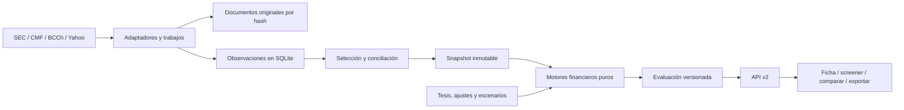

# Arquitectura y contratos de datos

## Decisión de arquitectura

Monolito modular Python/FastAPI, SQLite local y un worker local administrado por el ciclo de vida de la aplicación. React/TypeScript con Vite para la interfaz nueva, generada como archivos estáticos servidos por FastAPI. El usuario inicia una aplicación; Node se necesita para construir/desarrollar el frontend, no para utilizar la distribución compilada. La elección busca contratos verificables y manejo fiable de formularios, revisiones y respuestas asíncronas. Referencias técnicas: [FastAPI lifespan](https://fastapi.tiangolo.com/advanced/events/), [Vite](https://vite.dev/guide/) y [React con TypeScript](https://react.dev/learn/typescript).



## Estructura propuesta

```text
backend/v2/
  bootstrap.py
  domain/                 # instrument, fact, period, scenario, assessment, ledger
  ports/                  # providers, repositories, clock
  application/            # ingest, reconcile, assess, screen, refresh, migrate
  engines/
    periods.py
    normalization.py
    quality.py
    valuation/            # fcff, reverse, bank, reit, cyclical, sotp
    scoring.py
    returns.py
    portfolio.py
  adapters/
    providers/            # sec, cmf, bcch, yahoo, document_import
    persistence/          # sqlite schema, migrations, repositories, raw_store
  jobs/                   # worker, lease, retry and provider policies
  api/                    # Pydantic request/response schemas and routers
  compatibility/          # v1 serializers and data export bridge
web/
  src/api/                # generated types, client, error mapping
  src/features/           # research, company, valuation, portfolio, data
  src/components/         # metric, evidence, coverage, forms, chart
  src/routes/
tests/v2/
  unit/ contract/ integration/ fixtures/ acceptance/
```

Regla: `domain` y `engines` no importan FastAPI, proveedores, HTTP, filesystem ni reloj real. Entradas y salidas tipadas; cálculo determinista. `application` coordina puertos. `adapters` obtiene/persiste. `api` valida y serializa. Ningún import desde v2 hacia `backend.main`; el ensamblaje de dependencias está en `bootstrap.py`.

La única autoridad de valoración y puntuación es `AssessmentService`. Screener, comparador y watchlist seleccionan evaluaciones guardadas; sus respuestas incluyen `assessmentId`. Una edición de escenario crea una evaluación nueva, nunca modifica parcialmente otra.

## Identidad

| Entidad | Campos y reglas |
|---|---|
| Issuer | `issuerId`, nombre legal, país, identificadores tipados CIK/RUT/LEI si disponibles |
| Instrument | `instrumentId`, `issuerId`, tipo (acción, ADR, ETF), clase, derechos, ISIN opcional |
| Listing | `listingId`, `instrumentId`, MIC, símbolo, moneda, zona horaria, estado y vigencia |
| ProviderSymbol | proveedor/capacidad, símbolo, listing, vigencia y resolución de identidad |
| DepositaryRelation | ADR/instrumento subyacente, ratio, inicio/fin, fuente; nunca inferido sólo por nombre |

CIK identifica un emisor, no todas sus clases intercambiables. `.SN` es una convención del proveedor, no el identificador interno. País de domicilio, bolsa y moneda son dimensiones diferentes. Tickers renombrados o dados de baja permanecen en historial.

## Semántica de una cifra

El esquema normativo inicial está en [fact.schema.json](contracts/fact.schema.json). Los ejemplos son sintéticos, no observaciones de empresas reales.

| Grupo | Campos mínimos | Regla |
|---|---|---|
| Identidad | `factId`, `issuerId`, `instrumentId?`, `listingId?`, `concept` | Métrica de emisor o instrumento según definición |
| Magnitud | `value`, `unit`, `currency`, `scale`, `originalValue`, `originalUnit`, `originalScale` | Decimal como string; valor canónico en unidades base, escala 1. No adivinar miles por magnitud |
| Período | inicio, fin, instant/duration, FY/FQ/YTD/TTM, año/cierre fiscal | Fechas reales; no usar sólo etiqueta de año |
| Contexto | consolidado, dimensiones, taxonomía/tag, base de acciones | No sumar segmentos a consolidado ni mezclar denominadores |
| Tiempo | `publishedAt`, `firstSeenAt`, `retrievedAt`, `timestampPrecision` | Desconocido permanece null; publicación no se inventa a partir de descarga |
| Origen | `origin` y `provider` | reported/derived/estimate/assumption/manual_judgment; proveedor real |
| Disponibilidad | available/missing/not_applicable/unsupported/blocked + reason | 0 es dato disponible; missing implica null |
| Calidad | freshness, reconciliation, validation | Ejes separados; ningún score genérico de confianza sin definición |
| Evidencia | documento, URL, ubicación/tag/página, hash, accession | Todo valor reportado debe tener fuente; datos secundarios pueden tener payload como evidencia |
| Linaje | input fact IDs, transformation/version, adjustment IDs | Dependencias completas y reproducibles |

Para períodos anuales no calendarios se conserva la fecha fiscal exacta. Saldos son instantáneos; ingresos/FCF son duraciones. Las unidades `money`, `money_per_share`, `shares`, `ratio`, `percent` y `count` no son intercambiables; ratio se almacena en fracción decimal y percent expresa puntos de porcentaje cuando se declare así. El modelo de escenarios usa tasas como fracciones, por ejemplo 0,08.

EPS básico/diluido y acciones medias básicas/diluidas se separan de acciones al cierre. Cada serie accionaria declara base original o ajustada y fecha/factor de ajuste. Precios distinguen `raw`, `split_adjusted` y `total_return`; no sustituir uno por otro en fallback.

### Tiempos e historia

`asReported` selecciona la versión disponible en la fecha de corte; `latestRestated` usa revisiones posteriores para análisis actual. Son consultas distintas. Si sólo existe una fecha de publicación sin hora, adoptar de forma conservadora la siguiente sesión para pruebas históricas. Si se desconoce publicación, excluir del backtest hasta `firstSeenAt` y etiquetar esa restricción.

`retrievedAt` y `firstSeenAt` reflejan capturas reales y nunca se retrofechan. Un documento histórico puede tener `publishedAt` anterior si existe evidencia verificable. La consulta histórica usa la publicación y revisión elegible; si publicación es desconocida, usa conservadoramente `firstSeenAt`. Una captura nueva no convierte un cierre antiguo en precio nuevo.

## Selección y conciliación

Agrupar candidatos sólo si concepto, período, unidad, moneda, emisor, consolidación y definición coinciden. La política no puede decir simplemente «SEC gana todo el año».

1. Validar unidad, signos, calendario y contexto.
2. Conservar candidatos y versiones originales.
3. Preferir reporte primario en definición compatible; revisión explícita según modo histórico.
4. Comparar contra candidato secundario sólo después de normalizar semántica.
5. Registrar `SelectionDecision`: candidatos, elegido, regla/versión, tolerancia y diferencias.
6. Si hay discrepancia material no explicada, bloquear cálculos dependientes. La resolución manual registra autor, razón, evidencia y fecha; no sobrescribe el original.

Tolerancias iniciales como política de QA: montos del mismo reporte ±máximo de redondeo publicado y 0,1%; EPS según precisión del reporte; diferencias de mercado evaluadas para misma sesión/ajuste. Los umbrales son configurables y no autorizan diferencias de período. Un umbral de precio para alerta no demuestra que un feed sea oficial.

## Snapshot y evaluación

`DatasetSnapshot` fija `listingId`, moneda de cotización e IDs de hechos seleccionados, fecha de corte, políticas, revisiones, precio, FX y acciones corporativas. Se crea una vez y puede recalcularse sin red.

`Assessment` contiene `assessmentId`, `datasetSnapshotId`, `instrumentId`, `listingId`, `quoteCurrency`, `scenarioSetRevision`, `normalizationRevision`, `thesisRevision`, `portfolioSnapshotId?`, versiones de motores/políticas, `asOf`, resultados, cobertura y bloqueos. Su identidad se deriva de entradas/versiones normalizadas o usa UUID con hash determinista adicional. Un precio nuevo produce nueva evaluación; no parchear la cotización de una valoración anterior.

Separar `financialAssessment` de `personalAssessment`: el primero es reproducible con datos/supuestos; el segundo incorpora tesis y cartera de Pablo. Las pantallas permiten escoger uno y lo rotulan. El screener personalizado incluye las mismas revisiones manuales que la ficha; si no existen, muestra pendiente.

## Persistencia y transacciones

Tablas: `issuers`, `instruments`, `listings`, `provider_symbols`, `documents`, `observations`, `observation_inputs`, `selection_decisions`, `snapshot_facts`, `snapshots`, `adjustments`, `normalization_revisions`, `scenario_revisions`, `assessments`, `thesis_revisions`, `evidence_links`, `transactions`, `corporate_actions`, `watchlist`, `alerts`, `alert_events`, `jobs`, `provider_attempts`, `migration_runs`.

Restricciones: claves foráneas; IDs de versión inmutables; unicidad de documento por hash y proveedor; idempotencia de importación/evento/job; optimistic locking de tesis mediante número de revisión. Evitar guardar únicamente JSON opaco: campos necesarios para buscar/seleccionar van a columnas indexadas, payload original y parámetros extensibles pueden ser JSON.

SQLite `foreign_keys=ON`, busy timeout y transacciones cortas. API y worker escriben mediante los mismos repositorios; SQLite serializa las escrituras. Conexiones separadas por unidad de trabajo, sin compartir una conexión concurrentemente ni encolar guardados personales detrás de descargas. WAL permite concurrencia de lectura/escritura, pero requiere disco local y conserva un único escritor. Backups con API de backup y manifest de documentos, no copia aislada del `.db` abierto. Ver [SQLite WAL](https://www.sqlite.org/wal.html). En M0 comprobar también la versión SQLite enlazada al runtime y correcciones vigentes antes de fijarla.

`INVERSOR_DATA_DIR` independiente del checkout; propuesta macOS `~/Library/Application Support/InversorInteligente/`. Durante desarrollo usar directorio explícito de pruebas. Nunca compartir escrituras del ledger entre servidor legado y v2. Guardar crudos por hash, índice en DB y configuración de retención; no introducir pickle en importaciones.

## Proveedores, caché y trabajos

Puertos por capacidad: `get_instruments`, `get_prices`, `get_filings`, `get_facts`, `get_actions`, `get_fx`, `get_estimates`, `get_benchmark`. Cada proveedor implementa sólo capacidades verificadas. La consulta diaria funciona mientras la app está abierta; al iniciar se programan actualizaciones vencidas. El MVP no instala un servicio permanente del sistema. `ProviderResult` incluye status, datos, captura, source, fetchedAt, retryAfter y error enumerado.

Errores: `not_covered`, `not_reported`, `rate_limited`, `auth_required`, `provider_unavailable`, `invalid_payload`, `schema_changed`. HTTP 200 vacío no se considera automáticamente ausencia de reporte. No fallar hacia un proveedor que cambie unidad, feed o definición sin reflejarlo en el resultado.

Cache key: proveedor/capacidad/identidad/parámetros/corte/versión del parser. TTL por recurso; conservar último resultado válido separado de intentos fallidos. Caducidad de caché no borra historia ni hechos. `forceRefresh` sólo crea/reutiliza un trabajo; un GET de análisis no desencadena decenas de consultas ocultas.

Job con clave idempotente, estado `queued/running/partial/succeeded/failed/cancelled`, intento, lease, nextAttemptAt, error, resultados por instrumento y progreso. Claim transaccional; lease vencido se recupera; cancelación cooperativa. Backoff exponencial con jitter, Retry-After y presupuesto por proveedor. No reintentar 401/403 de forma agresiva.

## API v2

| Ruta | Semántica |
|---|---|
| GET `/api/v2/health` | build, schema y preparación; sin secretos |
| GET `/api/v2/instruments?query=` | Catálogo local tipado; distingue cero resultados de error de sincronización |
| GET `/api/v2/instruments/{id}/overview` | Último expediente útil, snapshots y capacidades |
| POST `/api/v2/refreshes` | Capacidades/períodos/ID; 202 + job; Idempotency-Key |
| GET `/api/v2/jobs/{id}` | Estado y resultados parciales por instrumento |
| POST `/api/v2/jobs/{id}/cancel` | Cancelación del trabajo |
| GET `/api/v2/snapshots/{id}` | Datos seleccionados y estado |
| GET `/api/v2/facts/{id}` | Valor, definición, evidencia y linaje |
| GET `/api/v2/documents/{id}` | Metadatos y acceso al documento local permitido |
| POST `/api/v2/assessments` | Snapshot + revisiones explícitas; resultado versionado |
| GET `/api/v2/assessments/{id}` | Evaluación inmutable común a las vistas |
| POST `/api/v2/simulations` | Inputs tipados, sin red ni persistencia de decisión; eco de requestId |
| POST `/api/v2/scenario-revisions` | Guardar conjuntos de supuestos versionados |
| POST `/api/v2/normalization-revisions` | Guardar ajustes con evidencia y revisión independiente |
| POST `/api/v2/theses/{instrumentId}/revisions` | Base revision + evidencia; conflicto 409 |
| GET `/api/v2/screener` | Query de evaluaciones; filtros de cobertura/aplicabilidad; cursor |
| POST `/api/v2/imports` | Validación previa + manifest; aplicar explícitamente después de previsualizar |
| GET/POST `/api/v2/portfolio/transactions` | Ledger tipado y eventos de corrección |
| GET `/api/v2/provider-status` | Capacidades y último resultado válido/último fallo |
| POST `/api/v2/backups` | Backup consistente y verificable |

Envelope de error: `error.code`, `message`, `details`, `requestId`, `retryable`, `retryAfterSeconds?`. 404 sólo identidad inexistente; 409 conflicto de revisión/estado; 422 inputs inválidos; 503 dependencia no disponible sin copia. Un análisis parcialmente calculable retorna 200 con bloqueos en su dominio, no una excepción genérica.

Contratos JSON iniciales en `contracts/` fijan semántica de hechos y simulación FCFF. En M0/M1 se convierten a modelos Pydantic completos y OpenAPI; generación de tipos TypeScript desde OpenAPI con revisión de cambios incompatibles. Son esquemas de diseño, no endpoints ya implementados.

## Frontend y seguridad local

Un cliente API con cancelación, timeout y revisión de respuesta. Estado indexado por instrumento/assessment; guardar símbolo y revisión al iniciar debounce. Una respuesta vieja se descarta. Filtros trabajan con números, nunca con strings formateados. Compilar assets con hashes; eliminar versiones manuales `?v=90` como estrategia de despliegue.

Origen único local; validar Host/Origin y proteger escrituras. Credenciales permanecen en servidor, ocultas de logs, URLs de usuario y backup exportable. No servir archivos arbitrarios desde rutas de documentos. Extensión a LAN/comercial requiere otra decisión de autenticación y licencias; no es condición del MVP personal.
